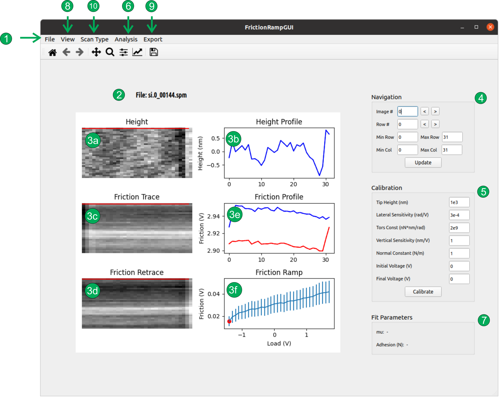

# AFM-Friction-Ramp-Analysis User Guide

This python application can be used to analyze ramps/series of AFM lateral force images, providing the correspondig friction vs load plots. 

At present it has only been tested for images obtained with the Nanoscope v9 software on a Multimode 8 AFM. It will probably work for images obtained with some other Nanoscope versions and Bruker/Veeco AFMs, but I am not sure.

## Quick Start

1. Clone/fetch/download the repository.(I have not tested it with other versions).
2. A virtualenv virtual environment is provided with the repository. To activate it, just go to the main folder and type:
	```python
	source env/bin/activate
	```
	If you do not have virtualenv, just follow these [instructions](https://virtualenv.pypa.io/en/latest/installation.html).

	If you prefer other strategies, you will need the following packages:
	* PyQt5 5.15.0
	* matplotlib 3.3.2
	* numpy 1.19.2 
	* scipy 1.5.2
3. From the main folder run:
	```python
	python -m friction_ramp_analysis
	```
	Thiw will open the following graphical Interface:
	

## Loading and looking at data
After initializing the application, go to the menu bar and in File click on Load Images. Then select a series of consecutive AFM images obtained while varying the set point. You will then get something like:


In the first row of the plot area, the topography channel (in case it was registered) and corresponding profile are shown.

The trace and retrace friction channels iare shown in the second and third row of the first column of the plot area.

The trace and retrace profiles of the raw friction signal corresponding to the selected row are shown in the second row second column of the plot area.

The friction vs load plot is shown in the bottom right corner of the plot area.

In the upper right section of the main window it is possible to change the visualized image and row. It is also possible to select a range of rows and columns to perform further analysys.

## Data Analysis

