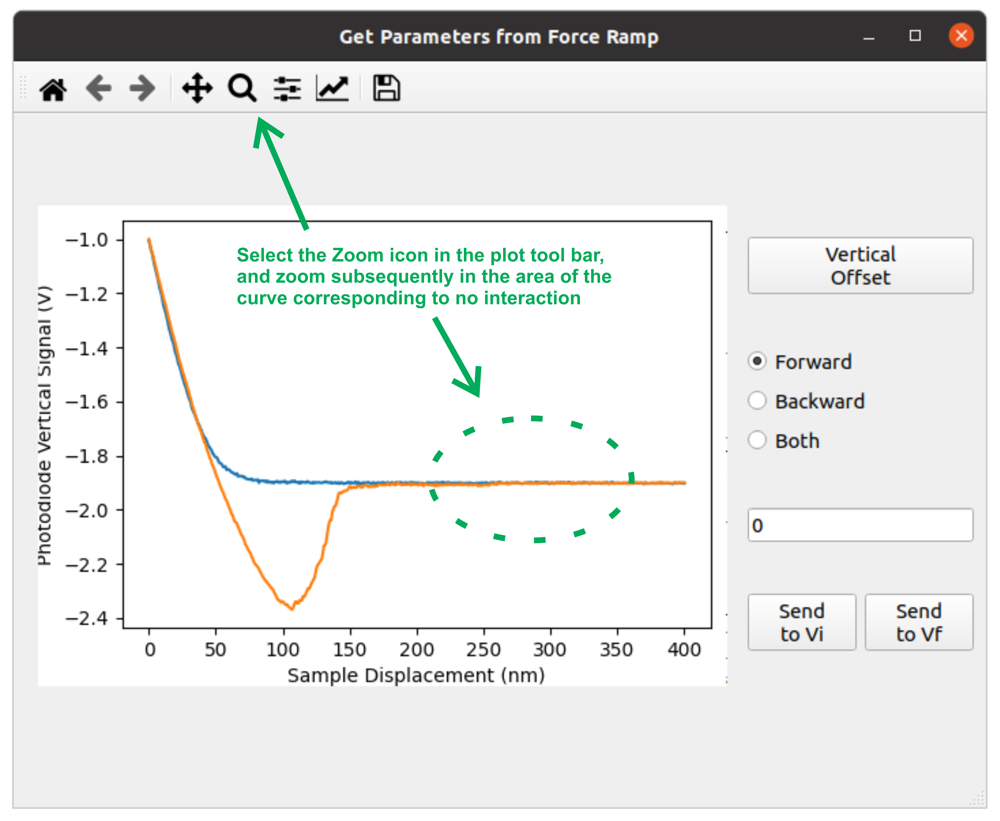
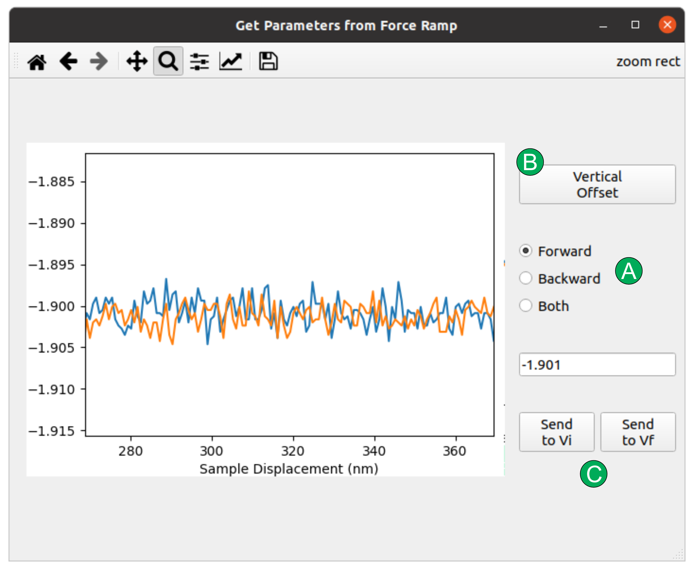

# AFM-Friction-Ramp-Analysis User Guide

This python application can be used to analyze ramps/series of AFM lateral force images, providing the correspondig friction vs load plots. 

At present it has only been tested for images obtained with the Nanoscope v9 software on a Multimode 8 AFM. It will probably work for images obtained with some other Nanoscope versions and Bruker/Veeco AFMs, but I am not sure.

## Quick Start

1. Clone/fetch/download the repository.(I have not tested it with other versions).
2. A list of required packages is provided (requirements.txt). I suggest you install them in a virtual environment, e.g.:
	```
	python3 -m venv friction_env
	source friction_env/bin/activate
	pip install -r requirements.txt
	```
	If you do not have virtualenv, just follow these [instructions](https://virtualenv.pypa.io/en/latest/installation.html).

	If you prefer other strategies, you will basically need the following packages:
	* PyQt5 5.15.0
	* matplotlib 3.3.2
	* numpy 1.19.2 
	* scipy 1.5.2
3. From the main folder run:
	```
	python3 -m friction_ramp_analysis
	```
	Thiw will open the following graphical Interface:
	

## Loading and looking at data
After initializing the application, go to the menu bar and in File click on Load Images. Then select a series of consecutive AFM images obtained while varying the set point. You will then get something like:


In the first row of the plot area, the topography channel (in case it was registered) and corresponding profile are shown.

The trace and retrace friction channels are shown in the second and third row of the first column of the plot area.

The trace and retrace profiles of the raw friction signal corresponding to the selected row are shown in the second row second column of the plot area.

The friction vs load plot is shown in the bottom right corner of the plot area. Just after loading the images, this plot will represent raw lateral vs vertical photodetector signals. In order to obtain a plot of friction vs load forces, 

In the upper right section of the main window it is possible to change the visualized image and row. It is also possible to select a range of rows and columns to perform further analysys.

## Data Analysis
In the bottom right corner of the main window one can enter the parameters needed for transforming into forces the raw lateral and vertical photodetector signals. Have a look at this [paper](https://pubs.acs.org/doi/full/10.1021/la201673r) and its referenced for the underlying theory.

In the same section it is also possible to enter the vertical photodetector signals corresponding to the cantilever far from the sample at the beginning and end of the experiment. This allows correcting drifts in this signal during the time of the experiment. These quantities can be entered manually, or obtained from force curves. For this latter approach, in the menu bar go to Analysis->Offset from FZ. The following window will show up:


Zoom in the region corresponding to the free non-interacting cantilever, select whether to calculate the offset from the forward curve, from the backward curve, or from the average of both:


Press the Vertical Offset Button. The press Send to Vi or Send to Vf buttons to send to the Main Window the calculated offset as the one corresponding to the start or to the end of the experiment.

Finally, in the Main Window press Calibrate to get the friction vs load plot in force units.

## Export Data
In the Menu Bar, go to Export->Friction Ramp, and there select between Raw and Calibrated. This will allow you to export the (raw or calibrated) friction vs load plot in 2 columns ASCII file.


